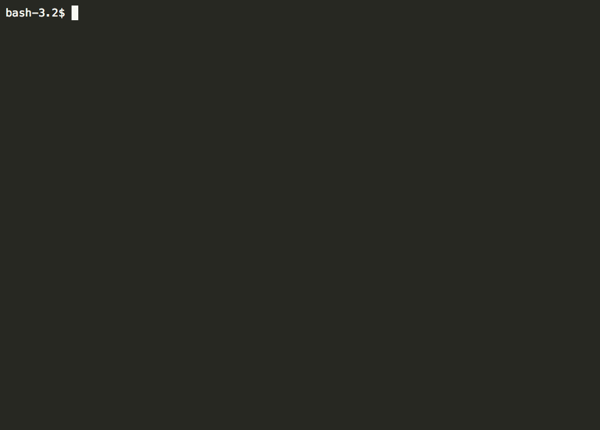

# brokr

brokr is a CLI application that allows you to manage your Tradier brokerage accounts, including the ability to place orders, view pending orders and existing positions, and get real-time quotes.

## Features and limitations

The commands listed in `brokr --help` should be available for use.

brokr is currently limited to buy and selling stocks. The ability to trade options will be implemented in the near future.

## Development

- Go 1.8+
- Glide
